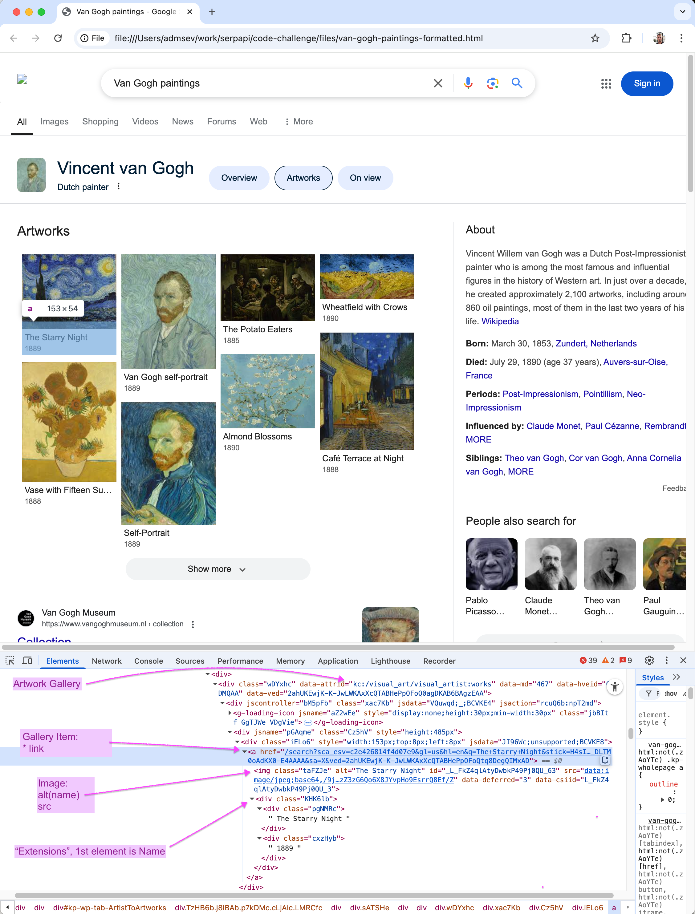

# Extract Van Gogh Paintings Code Challenge

Goal is to extract a list of Van Gogh paintings from the attached Google search results page.


## Instructions

This is already fully supported on SerpApi. ([relevant test], [html file], [sample json], and [expected array].)
Try to come up with your own solution and your own test.
Extract the painting `name`, `extensions` array (date), and Google `link` in an array.

Fork this repository and make a PR when ready.

Programming language wise, Ruby (with RSpec tests) is strongly suggested but feel free to use whatever you feel like.

Parse directly the HTML result page ([html file]) in this repository. No extra HTTP requests should be needed for anything.

[relevant test]: https://github.com/serpapi/test-knowledge-graph-desktop/blob/master/spec/knowledge_graph_claude_monet_paintings_spec.rb
[sample json]: https://raw.githubusercontent.com/serpapi/code-challenge/master/files/van-gogh-paintings.json
[html file]: https://raw.githubusercontent.com/serpapi/code-challenge/master/files/van-gogh-paintings.html
[expected array]: https://raw.githubusercontent.com/serpapi/code-challenge/master/files/expected-array.json

Add also to your array the painting thumbnails present in the result page file (not the ones where extra requests are needed). 

Test against 2 other similar result pages to make sure it works against different layouts. (Pages that contain the same kind of carrousel. Don't necessarily have to be paintings.)

The suggested time for this challenge is 4 hours. But, you can take your time and work more on it if you want.


# The result

## Overview

The project extracts structured data from carousels in Google's search results pages.

The implementation supports multiple types of galleries, including artworks, music albums, books, and TV shows/movies.

## Technical Architecture

### Core Design Principles

1. **Extensibility**: The system is designed with a factory pattern and inheritance hierarchy to easily support new gallery types
2. **Maintainability**: Clear separation of concerns between page loading, parsing, and output generation
3. **Robustness**: Handles JavaScript-rendered content through Ferrum, ensuring reliable data extraction
4. **Testability**: Comprehensive test suite covering multiple gallery types

### Component Architecture

```
lib/
├── gallery_parser.rb           # Main entry point
├── factories/
│   └── gallery_parser_factory.rb  # Factory for creating appropriate parsers
└── parsers/
    ├── base_gallery_parser.rb     # Abstract base class
    ├── artwork_gallery_parser.rb  # Artwork-specific implementation
    ├── music_albums_gallery_parser.rb
    ├── author_books_gallery_parser.rb
    └── person_tv_shows_and_movies_gallery_parser.rb
```

### Key Technical Decisions

1. **JavaScript Handling**
   - Used Ferrum for headless browser automation
   - Enables reliable extraction of dynamically loaded content
   - Future-proof against Google's JavaScript-based rendering

2. **Parser Architecture**
   - Factory pattern for creating appropriate parsers
   - Base class with common functionality
   - Specialized subclasses for each gallery type
   - Easy to add new gallery types without modifying existing code

3. **Data Extraction Strategy**
   - Robust CSS selectors for gallery identification
   - Flexible image source handling (base64 vs external URLs)
   - Clean separation of data extraction logic

## Usage

```shell
# Artworks:
ruby lib/gallery_parser.rb spec/fixtures/pages/van-gogh-paintings.html

# Music Albums:
ruby lib/gallery_parser.rb spec/fixtures/pages/taylor-swift-albums.html

# Author's Books:
ruby lib/gallery_parser.rb spec/fixtures/pages/agatha-christie-books.html

# Persons TV shows and movies:
ruby lib/gallery_parser.rb spec/fixtures/pages/agatha-christie-movies-and-tv-shows.html
```

## Testing

The test suite includes:
- Unit tests for each parser type
- Integration tests with real HTML fixtures
- Validation against expected JSON output

```bash
# Run tests
bundle exec rspec

# Verify output matches expected JSON
ruby lib/gallery_parser.rb files/van-gogh-paintings.html | diff - files/expected-array.json
```

## Development Setup

1. Install dependencies:
   ```bash
   bundle install
   ```

2. Run tests:
   ```bash
   bundle exec rspec
   ```

# Research and decision making log

## Expectations

We need to parse the page and output the gallery's content as JSON, matching the structure in [files/expected-array.json](files/expected-array.json):

Output JSON structure:
```json
{
    "artworks": [
        {
            "name": "The Starry Night",
            "extensions": ["1889"],
            "link": "https://www.google.com/search?...",
            "image": "data:image/jpeg;base64,..." // or external URL
        }
    ]
}
```
## Locating the Needed Content



* **Artwork Gallery**: Can be located using the `[data-attrid="kc:/visual_art/visual_artist:works"]` selector.
* **Gallery Items**: Each anchor (`a`) element in the gallery with an `href` attribute that begins with `/search?sca_esv`

## Output JSON - what's needed

### $.artworks[*].name
Each gallery item's `img` tag has an `alt` attribute containing the artwork's name. This value is also duplicated as the first item in the "extensions" section (see the screenshot). I chose to use the `alt` attribute.

Although both values match, in a real-world environment they should be double-checked.

### $.artworks[*].extensions

Each gallery item contains a list of text elements that can be accessed using `element.xpath('./div/div')`. These elements include:

1. The artwork name (first element)
2. Additional details like year, medium, etc. (subsequent elements)

When comparing against [files/expected-array.json](files/expected-array.json), we only want to include the additional details (elements after the first one) in the `extensions` array. The artwork name is already captured separately in the `name` field.

For example, for "The Starry Night":
- First element: "The Starry Night" (excluded from extensions)
- Second element: "1889" (included in extensions)

### $.artworks[*].link

Each **Gallery Item** link has a `href` attribute (see the screenshot).

### $.artworks[*].image

The "image" attributes in the expected JSON contain two types of URLs:

| Type | Base64-encoded thumbnails | External image references |
|------|--------------------------|--------------------------|
| When used | Items displayed immediately | Items after clicking "Show more" |
| Location | First page of gallery | Additional pages |
| Format | `data:image/jpeg;base64,...` | `https://encrypted-tbXX.gstatic.com/images?q=tbn:...` |
| Initial state | `img[src]` has placeholder | `img[src]` has placeholder |
| Data source | JavaScript replaces `img[src]` using `img[id]` | `img[data-src]` contains actual URL |
| `data-src` present? | No | Yes |
| Value to use | Final `img[src]` value | `img[data-src]` value |

**Solution**: Use `img[data-src]` if present, otherwise `img[src]`

## Parsing the page: technology choice

Since the page relies on **JavaScript** execution, we have two options:
1. Parse the values for `img[src]` from the JavaScript code.
2. Execute JavaScript on the page to perform the task.

Here's a comparison of these two approaches:

| Aspect | Direct parsing (Nokogiri/ruby) | Headless browser (Ferrum) |
|--------|--------------------------------|---------------------------|
| Performance | ✅ Faster execution | ❌ More overhead, slower |
| Implementation | ❌ Tighter coupling to Google's code, **Fragile** | ✅ Simpler implementation |
| Testing needs | ❌ Requires extensive E2E testing: JS code may change | ✅ Less testing complexity |
| Long-term viability | ❌ More maintenance needed | ✅ More sustainable |
| CAPTCHA handling | ❌ No Javascript | ✅ Better handling |

**I chose to use Ferrum** as it seems to be the more sustainable approach. We can optimize this if/when performance becomes an issue.

Now that the `img[src]` placeholder is replaced by real value, we can use it to set the `image` attribute in the output JSON.

## Additional galleries types

> Test against 2 other similar result pages to make sure it works against different layouts. (Pages that contain the same kind of carrousel. Don't necessarily have to be paintings.)

⚠️ It was challenging to understand what "different layouts", "same kind of carousel" and "don't necessarily have to be paintings" meant altogether.

I tried to search for different types of artworks.

| Search Query | Gallery Type | data-attrid | Implemented on serpapi.com | Implemented in this PR |
|-------------|------|-------------|---------------------------|---------------------|
| Van Gogh Paintings | Visual Artist Artworks | `kc:/visual_art/visual_artist:works` | ✅ | ✅ |
| Taylor Swift albums | Music Artist Albums | `kc:/music/artist:albums` | ❌ | ✅ |
| Agatha Christie books | Author Books | `kc:/book/author:books only` | ❌ | ✅ |
| Agatha Christie movies and tv shows | Person TV Shows and Movies | `kc:/people/person:tv-shows-and-movies` | ❌ | ✅ |
