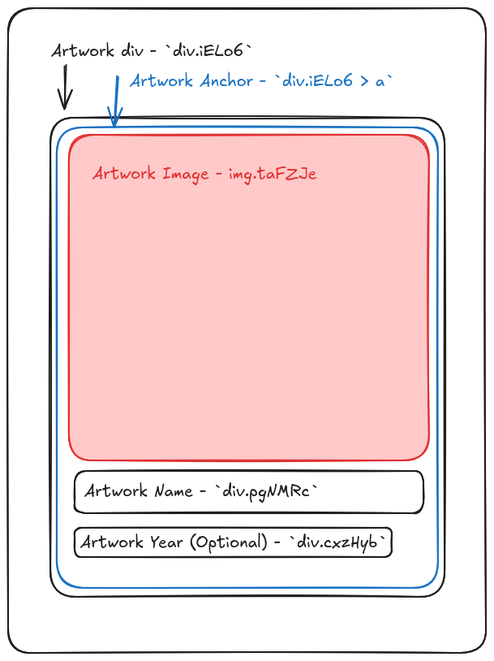

# Extract Van Gogh Paintings Code Challenge

Goal is to extract a list of Van Gogh paintings from the attached Google search results page.


## Instructions

This is already fully supported on SerpApi. ([relevant test], [html file], [sample json], and [expected array].)
Try to come up with your own solution and your own test.
Extract the painting `name`, `extensions` array (date), and Google `link` in an array.

Fork this repository and make a PR when ready.

Programming language wise, Ruby (with RSpec tests) is strongly suggested but feel free to use whatever you feel like.

Parse directly the HTML result page ([html file]) in this repository. No extra HTTP requests should be needed for anything.

[relevant test]: https://github.com/serpapi/test-knowledge-graph-desktop/blob/master/spec/knowledge_graph_claude_monet_paintings_spec.rb
[sample json]: https://raw.githubusercontent.com/serpapi/code-challenge/master/files/van-gogh-paintings.json
[html file]: https://raw.githubusercontent.com/serpapi/code-challenge/master/files/van-gogh-paintings.html
[expected array]: https://raw.githubusercontent.com/serpapi/code-challenge/master/files/expected-array.json

Add also to your array the painting thumbnails present in the result page file (not the ones where extra requests are needed). 

Test against 2 other similar result pages to make sure it works against different layouts. (Pages that contain the same kind of carrousel. Don't necessarily have to be paintings.)

The suggested time for this challenge is 4 hours. But, you can take your time and work more on it if you want.

-------------------------------------------------------------------------------

# Solution

The source of the page contains images in the markup of the artwork knowledge panel in two forms. Images above the fold
that are not in the truncated part of the panel, are embedded as base64 encoded data in the page itself. Image not
visible contains links to the image files to display, which are fetched when user expands the section.

Each artwork in the panel has the following structure:


```html

<div class="iELo6">
  <a href="{relativeURL}">
    
    <div class="KHK6lb">
      <div class="pgNMRc">{name}</div>
      <!-- optional year -->
      <div class="cxzHyb">{year}</div>
    </div>
  </a>
</div>

## Implementation
```

### Extracting Images

Extracting the other values is straightforward, but images require special handling due to their different formats:

- For the remote images, the solution extracts the image url from the `data-src` attribute
- For the embedded images, the solution extracts the data from script tags. The source contains script tags with the
  base64 encoded image data for lazily rendered images. These script tags can be associated with their respective
  artwork using the id attribute on image and `ii` variable in the script. Then the image data can be extracted from the
  `s` variable in the script tag.

## Code

Since I did not have prior ruby experience I implemented a solution in TypeScript using the `cheerio` library for HTML
parsing.

Following that I caught up on some ruby basics, and then implemented a ruby solution with the typescript code as the
reference implementation.

### Files

```txt
├── bin
│   ├── extractor.rb - Ruby script to run the extractor
│   └── extractor.ts - TypeScript script to run the extractor
├── files - Test HTML files
│   ├── ...
│   ├── hokusai-artwork.html
│   ├── mc-escher-artwork.html
│   ├── van-gogh-paintings.html
│   └── ...
├── ...
├── lib
│   ├── extractor.rb - Ruby extractor functionality
│   └── extractor.ts - TypeScript extractor functionality
├── ...
├── spec
│   ├── extractor_spec.rb - Ruby RSpec tests for the extractor
│   ├── extractor.spec.ts - TypeScript tests using the node builtin test utils
│   └── spec_helper.rb
└── ...
```

## Running the code

### Setup

#### With Mise

If you have [Mise](https://github.com/jdx/mise) you can use that to set up the environment for both node and ruby.

```bash
mise install
```

#### Without Mise - Node

You'd need node > `23.6` (or node > `22.6` and with `--experimental-strip-types`) to run the typescript code. After
ensuring you have that, install dependencies:

```bash
npm install
```

#### Without Mise - Ruby

You'd need ruby > `3.0` to run the ruby code. After ensuring you have that, install dependencies:

```bash
bundle install
```

### Running

#### With Mise

Test the code with:

```bash
mise run test
```

This will run tests for the typescript version and the ruby version. Then run both and compare each of their outputs
with the output in `expected-array.json` file.

Run ts version with:

```bash
mise run ts:extract <html file> # Optionally pipe through jq for syntax highlighting `| jq`
```

Run ruby version with:

```bash
mise run ruby:extract <html file> # Optionally pipe through jq for syntax highlighting `| jq`
```

#### Without Mise

Run tests

```bash
npm test # For typescript
bundle exec rspec # For ruby
```

Run extractor
For typescript

```bash
npm run extract <html file>
```

For ruby

```bash
ruby bin/extractor.rb <html file>
```

#### Examples

```bash
mise run ts:extract files/van-gogh-paintings.html | jq
mise run ts:extract files/hokusai-artwork.html

npm run extract files/van-gogh-paintings.html

ruby bin/extractor.rb files/van-gogh-paintings.html | jq
ruby bin/extractor.rb files/hokusai-artwork.html

ruby bin/extractor.rb files/mc-escher-artwork.html | jq
```
