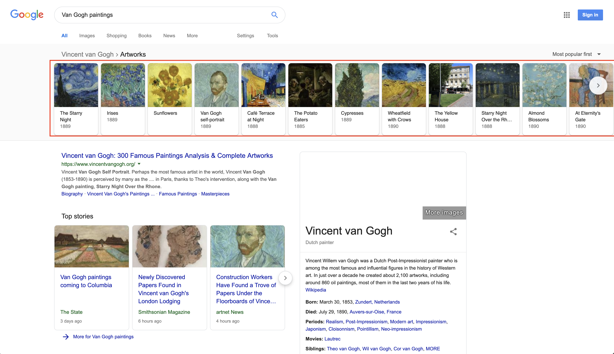
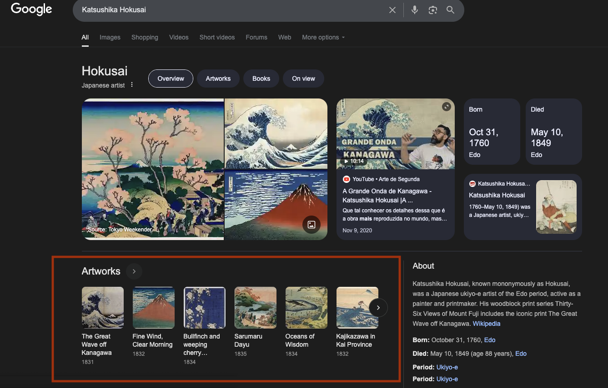

This PR implements a solution to parse artworks from google's search result.

# Cases covered
I've considered 2 cases: Artworks page (large carrousel from the example) and a default search page (small carrousel).





# Architecture
We have 2 main classes:

- `GoogleSearchPageCrawler` - Responsible for receiving a file path, fetch the page HTML and format the expected result as JSON
- `GoogleSearchPageCrawler::Parser` - Knows how to parse the page DOM. It's `parse` method returns a `GoogleSearchPageCrawler::Parser::Result`: a data/value object that uses dry struct. This makes our data structure more explicit and prevents mistyping errors that happens we just use a hash.

# Parsing logic

I've implemented everything in a single class but - if needed in the future - one idea is to split the parsing logic into multiple "sub-classes" instead of methods.

Example: `GoogleSearchPageCrawler::Parser::ListResult`, `GoogleSearchPageCrawler::Parser::Artworks`, etc.

Each class could parse a specific part of the page. While not strictly necessary, this approach can reduce cognitive load as the number of desired data grows.
It keeps the code more organized, cohesive and makes it easier to locate and fix a broken parsing rule.

I've tried to make the scraper more error prone by using a non obfuscated selectors such as `data-attrid="kc:/visual_art/visual_artist:works` and looking for text nodes instead of classes or dom hierarchy to search for the name/extensions.

The `parse_small_carrousel_artwork` and `parse_big_carrousel_artwork` methods are intentionally kept separate, even though their logic is similar. Both parse the same concept (Result::Artwork), but from different DOM structures. Keeping them distinct ensures that each case retains its own logic and execution strategy.

## Image parsing
The readme highlights that we have to keep the image attribute for both cases:

- the base64 encoded image
- the image link (those that require a click on the "show more" button)

When I've executed a test against the `expected-array.json` file, I've noticed that the `` tag has a gif as SRC. And we have 2 cases:

### img with id attribute
```html

```

The same ID can be found inside a script tag with their base64 encoded image.

```html
<script nonce="xmO6un4J9murPFDygFfaMA">(function(){var s='data:image/webp;base64,UklGRjQMAABXRUJQVlA4ICgMAAAQRACdASrhAJsAPxGAt1QsKCU1KDV7MqAiCWcHDtAkSjkn/r/Xf+ydgBeraVdn/9Px1UGv5GYPyffrugwzIfw/Rc/+vnb/kP/hwO2JbSYKG1VQIN78tct7QVKKyA/XDj2TQ174tLSeF8ejv+SZJ2zx....';var ii=['_L_FkZ4qlAtyDwbkP49Pj0QU_79'];var r='';_setImagesSrc(ii,s,r);})();</script>
```

So, we have to find the script tag with the same ID and extract the base64 encoded image from there.

### img with `data-src` attribute. Aditional request is needed
```html

```

We just use the `data-src` and return it.

# Usage

## Running tests
`bundle exec rspec` to run the specs

## Scraping a search page

Execute
`bundle exec ruby scrape_files.rb FILENAME.HTML` to use the `GoogleSearchPageCrawler` to crawl the page, parse the artworks and save the result inside the `files` folder.

It searches for the file in the `files` folder. Defaults to `van-gogh-paintings.html`

# Notes
## Interesting case - Following artwork link
There's another case that I found: when we click on an artwork and the list appears as a horizontal top list.

https://www.google.com/search?sca_esv=e77f9c08ad4d25ad&sxsrf=AE3TifPtmZe03gj5RYheiEGzNrtk6qieag:1755204957217&q=Bullfinch+and+weeping+cherry+blossoms&stick=H4sIAAAAAAAAAONgFuLQz9U3SCpPM1Hi1U_XNzRMNi5JrzKozNFSyk620i_LLC5NzIlPLCpBYmYWl1iV5xdlFy9iVXUqzclJy8xLzlBIzEtRKE9NLcjMS1dIzkgtKqpUSMrJLy7Ozy0GAHIW_uhnAAAA&sa=X&ved=2ahUKEwj_qO7_l4uPAxWrIrkGHbNdIp4QgOQBegQIMhAS

I didn't cover this case because I've noticed that it happens only when we follow an artwork link: the page loads with the artwork highlighted containing an empty href="#".

If we ever need to cover this case we can use the
`div[data-attrid="kc:/visual_art/visual_artist:works"] [role="group"] a` selector and maybe change the URL logic to have a "current page" information in order to return the correct link for the selected artwork.

## RAW HTML analysis

### Artwork specific page (Example from README)
The raw HTML (from 'view source code') lists all the artworks

### Normal search page ('small carousell')
The raw HTML (from 'view source code') lists only 6 artworks. The other ones seems to be inside a javascript.

Testing in the playground: https://serpapi.com/playground?q=monet&location=Austin%2C+Texas%2C+United+States&gl=us&hl=en it seems that SerpAPI does consider this case.

I didn't try to parse them because I believe that this is outside of scope of this exercise but I see other (and probably better) options:

- Instead of manually parsing scripts, we could consider using a real browser to evaluate the HTML before parsing the data. This is less performant but - if other parts of the page also requires this method - can be an alternative.
- We can follow the "Artworks" link and scrape everything from there using the "Artwork specific page" implementation (I believe that this is the way to go...)